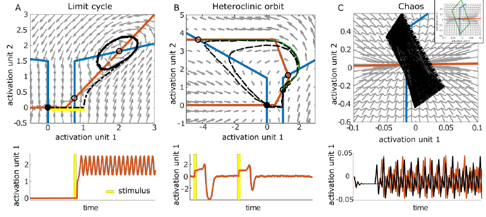
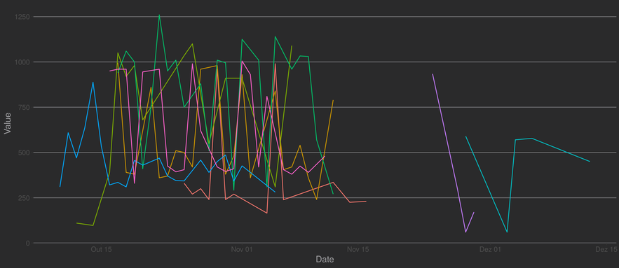

---
output:
  pdf_document: default
  word_document: default
  html_document: default
---
# Refining chronological assessment for affective disorders: Preliminary results of ecological momentary assessment in a community sample 
### Outlining clinical applications of the dynamical properties in neurobehavior.  
*Felipe Coelho Argolo*$^{1}$, *Pedro M. Pan*$^{1}$, *Rodrigo A. Bressan*$^{1}$   
Universidade Federal de São Paulo, Universidade Federal da Bahia  
email: felipe.c.argolo @protonmail.com; @protonmail.com; @gmail.com  

## Abstract

Changes in theories underlying brain function stablished basis for novel ideas in psychopatology, such as deep brain stimulation of specific areas and intervetions targeting microenvironment (e.g. microglia).  
Concerning affective disorders, mounting evidence relate the reward circuitry with mood states.  
The Brazilian High Risk Cohort is a large (started in 2010, n = 2,512) community sample in which brain network attributes were previously linked with depression onset.  
We present preliminary findings from the third phase of assessment (2017-2018). It includes ecological momentary assessment through through mobile phone (4 weeks intensive, 1 year sparse).  
@ Results  
@ Discussion  

*Keywords*: Affective disorders; Ecological Momentary Assessment; Depression; Bipolar Disorder; Dynamical Systems; Oberth Effect.

\pagebreak

## Introduction

In the last decades, multidisciplinary advances provided new frameworks to understand the nervous system of humans. On the physiological aspect, one could describe neural dynamics with enhanced precision, including populational activity [Greicius, 2003].   Noteworthy milestones were also achieved in reverse engineering the information processing mechanisms.  

The unraveled details imply that the interaction among different structures through time is key to understand global behavior.  
We may cite (1) encoding of reinforcement learning reward prediction errors by the neurons in the basal ganglia [Pessiglione, 2006], (2) spatial mapping of visual stimuli to cortical (V1,V2,V3) neurons activity [Ayzenshtat, 2012], (3) working memory attractor networks and long-term memory storage encoding in the hippocampus [Tsodyks, 2005] and (4) evolutively preserved central pattern generators for walking and swimming [Dimitrijevic, 2006].   
 
Joint effort has led to more coherent theories about mental disorders, comprising unexplained observations.   
Focusing on information processing and system states (embodied cognition) eliminates problems previously considered as paradoxes, since circuit states could be manipulated in equivalent ways whether via electrical current, drugs or behavioral interventions. Such anomalies were generally approached through ad-hoc hypotheses (e.g. normalization of chemical levels after electrically induced convulsions) [Bolwig, 2011].  

This prism also favored insights for clinical taxonomy and phenotyping, allowing for the conception of novel (yet to be validated) interventions targeting microenvironmental variables (e.g. microglia) and specific electrical activity (e.g. TMS) [REF: blood/fecal transplant@JamesLeckman ; DBS; TMS@Brunoni]  

This paper outlines potential advances contained in Ecological Momentary Assessment (EMA) for affective disorders. We (1) show preliminary findings from mobile data in a community sample, (2) discuss target axes of investigation and (3) techniques for analysis.   

### Dynamics in Neurobehavior of Mood  

Evolving from simple signaling processing organs wired to rudimentary motor responses [Churchland, 2012], the evolutionary emergence of complex nervous systems is a characteristic of higher animals. Mammals' brain possesses structures with marked distinct connections, functioning and developmental pathways [Krubitzer, 2009].  

Affective disorders express altered mood, a construct describing a base state influencing several instances of behavior. Positive mood is related to optimistic bias in evaluation of future scenarios. Instant perception of environmental experiences (e.g. more pleasant sensations) and self-percetion (e.g. increase in self-confidence) is also influenced [Pyszczynski, 1989]. Negative mood is intimately related to depression: negative bias for expectations, pessimistic evaluation of the environment, feelings of self worthlessness [Cheng, 2016].  

The underlying circuitry was one of the first targets of neuroscience, hence being extensively studied. The quantitative connection between reward prediction errors (RPE) and firing rates of dopaminergic neurons in the Basal Ganglia was extensively explored [Pessiglione, 2006] in several animals, including humans. A full characterization of networks heavily important for these functions is undergoing, however the prefrontal cortex (PFC) seems to play a very prominent hole. Often, the PFC (specially the mPFC) composes theories of mood functioning as a modulation hub [Price, 2012; Rolls, 2016]. Findings from neuroimaging support these circuits are related to depressive symptoms from an early age [Pan, 2017].  

Recent results give precise quantitative support for the relationship between RPE and self-perceived emotional states [Rutledge, 2017]. An ecological perspective suggests that mood regulates an organism's exploration and exploitation policies in the environment. For instance, restrained activity (e.g. lower motor activity, longer periods of sleep) may be strategically wise in scarcity situations. Risk-taking and exploration of new actions also presents a trade-off according to environmental conditions: volatile returns disencourage exploiting conservative policies [Humphries, 2012].   

Experimental efforts are far from completely closing the gap between theoretical constructs and observed phenomena. However, availale results suggest a close interaction between mood, environmental settings and rewards through time (e.g. seasonal manifestation of major depression and mania; reward-related trigger events for depression and mania; mammalian behavioral response to environment, including hibernation)  [Rolls, 2016]. In fact, the very definition of a major depressive episode requires minimal duration (4 weeks) for symptoms.   

Neurophysiological dynamics describe how such processes are instantiated in biological cells. Approaches include top-down generative models, in which one infers hidden characteristics of the nervous system by finding models capable of generating similar outputs [Friston, 2009]. Bottom-up approaches investigate global behavior of neural networks by simulating thousands of neurons from different populations. Dynamical system frameworks are often employed by both perspectives (top-down and bottom-up) in order to investigate time evolution of interacting strucures. This is generally done by expressing population firing with stable or quasi-stable state spaces using coupled differential equations [Durstewitz, 2018].  

  

\pagebreak

### Ecological momentary Assessment

EMA Protocol (Full texts of questions and screenshots in Supplement. Mat.?) - [REFs tansl Netherlands & Dynamore & Urban Minds]  
@ Analysis - Evaluating hidden states in timeseries measures (e.g. high mood, bad mood); relationship between variables (e.g. sleep vs. energy). Gaussian processess and dynamical systems. 

## Methods

### The Brazilian High Risk Cohort

The Brazilian High Risk Cohort (HRC) is a large (n = 2,512) community sample of youths (inclusion age range: 6-14y) stratified for high risk for mental disorders from 9,937 candidates. Three data collection phases occured (2010-2011, 2013-2014, 2018-Current).  

Measures include physiological data (e.g. fMRI, genome sequencing), clinical and neuropsychological tests. A subsample of 750 participants possess at least one brain image. It was used to demonstrate a relationship between previously cited brain networks and major depression [Pan, 2017].  

### Econological momentary assessment

Current phase includes It includes ecological momentary assessment  through mobile phone (4 weeks intensive, 1 year sparse).  
Participants and parents or relatives were asked to install and interact with our in-house Electronic Momentary Assessment (EMA) software. This application conforms to ethical norms and its used was approved by national and regional ethical research committees, it also obeys privacy and user right policies enforced by Google and Apple distribution server stores.

Our application gathers input through screen prompted self-report items. Users consent to every step of data collection.

Our protocol measures human behavior using multiple targets, such as: sleep patterns and quality, self-reported behavior, subjective emotional perception, composition of environmental surroundings, average dislocation by step count and social media activity.

*Supplementary material* provides a detailed reference list of items, including sources, description of prompted stimuli, measurement data types and referred code section

\pagebreak

## Results 

Table 1 - Descriptive data of sample

| Sample characteristics  |   |
|---|---|
| Age: mean(sd)  |   |
| Sex:%Male  |   |
| ?  |   |

Table 2 - Descriptive of time series

|   | Sleep quality  |  Relaxed | Well-being  | Active  | Happy  | Calm   | Energetic  |
|---|---|---|---|---|             ---|---|---|
| Volatity ( $\sigma$ )|   |   |   |   |          |   |   |
| Average ($\mu$)  |   |   |   |   |         |   |   |

Table 3 -  Cross-correlation between variables  

|   |   | Sleep duration  | Sleep quality  | Relaxed | Well-being  | Active  | Happy  | Calm   | Energetic  |
|---|---|---|---|---|---|---|---|---|
| Sl. duration   |   |   |   |   |   |   |   |   |
| Sl. quality  |   |   |   |   |   |   |   |   |
| Relaxed  |   |   |   |   |   |   |   |   |
| Well-being  |   |   |   |   |   |   |   |   |
| Active     |   |   |   |   |   |   |   |   |
| Happy |   |   |   |   |   |   |   |   |
| Calm   |   |   |   |   |   |   |   |   |
| Energetic  |   |   |   |   |   |   |   |   |

[Time series measures of 6 variables from 2 participants (blue and green)](images/EMA.png)  

  

## Discussion

@ "Physiological" sadness vs. Pathological sadness: several distinguishing characteristics, including severity, functional impairment and **chronology**. 

Psychiatrists are interested in understanding triggers and patterns associated with onset, remission and reincidence (a common feature of the disease).  

Indeed, researchers are already looking for the optimal chronological regimes in multiple session intervetions (e.g. infused sketamine or eletroconvulsivetherapy).  

This perspective also opens the possibility for the development of new psychoactive drugs, targeting distinct pharmacokinects and microbioavaliability instead of disease-specific receptors [Rajkumar, 2010].  

@ Chronological optimization 
Initial efforts to investigate therapeutical effects of psychoative drugs targeted stable ranges bioavailability.  

This is not always the optimal strategy: other medical specialties make use of temporal asymmetries to optimize effectiveness. Endochrinologists modulate hormonal axes in consonance with their natural dynamics (e.g. oral contraceptives with varying doses designed after the menstrual cycle) [Alam, 2014]. Cardiologists induce a desired state with drugs and also observe cardiac cyclic states in order to maximize efficiency in cardioversion [Killip, 1963].  

For instance, instead of maintaining a constant or slowly-increasing dosage, patients could benefit of time-varying dosages in precisely planned periods. We discuss how recently acquired tools (e.g. Ecological Momentary Assessment, EMA) provide potentially valuable measures for this approach.  

\pagebreak