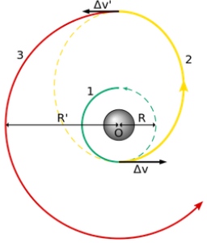

---
output:
  pdf_document: default
  html_document: default
---
# Chronological refinement of intervetion strategies for affective disorders using ecological momentary assessment - The Oberth effect
### Optimizing interventions by observing dynamical properties in neurobehavior.  
*Felipe Coelho Argolo*$^{1}$, *Pedro M. Pan*$^{1}$, *Rodrigo A. Bressan*$^{1}$   
Universidade Federal de São Paulo, Universidade Federal da Bahia  
email: felipe.c.argolo @protonmail.com; @protonmail.com; @gmail.com  

## Abstract

*Keywords*: Affective disorders; Ecological Momentary Assessment; Depression; Bipolar Disorder; Dynamical Systems; Oberth Effect.

\pagebreak

## Introduction

The dicovery of assets for treatment in psychiatry many times relied on serendipitious observations [Ban,2006].  

Antidepressants levered valuable investigations about mental disorders, such as the chemical imbalance theory [Deacon, 2009]. Since depressed patients responded to changes in neurotransmitters concentration, it was conjectured that they might posess uncommon levels of neural chemicals.  
Specific impairments were proposed for existing diagnostic clusters. The psychosis spectruum was investigated for dopaminergic alterations (Dopamine hypothesis), while depression was framed as a possible deficiency in molecules such as serotonin (Monoamine hypothesis) [Brich, 2014].   
These ideas yielded advances, such as the development of clean (*n-th generation*) drugs targeting specific receptors. Second generation drugs carry less side effects while keeping equivalent effectiveness [Davis, 2003].  

Nonetheless, several observations remain unexplained, as the efficiency of eletroconvulvetherapy for affective disorders and failed attempts to detect specific neurotransmitter profiles identifying patients and healthy individuals. These anomalies were generally approached through ad-hoc hypotheses (e.g. normalization of chemical levels after electrically induced convulsions) [Bolwig, 2011].  

In the last decades, multidisciplinary advances provided new frameworks to describe nervous systems of higher animals.  
On the physiological aspect, one could describe neural dynamics with enhanced precision, including populational activity [Greicius, 2003]. Noteworthy milestones were also achieve in reverse engineering the information processing mechanisms.
The unraveled details of networks present across species imply that the interaction among different structures through time is key to understand global behavior.  
We may cite (1) encoding of reinforcement learning reward prediction errors by the neurons in the basal ganglia [Pessiglione, 2006], (2) spatial mapping of visual stimuli to cortical (V1,V2,V3) neurons activity [Ayzenshtat, 2012], (3) working memory attractor networks and long-term memory storage encoding in the hippocampus [Tsodyks, 2005] and (4) evolutively preserved central pattern generators for walking and swimming [Dimitrijevic, 2006].   
 
Joint effort has led to more coherent theories about mental disorders, comprising previous anomalies.   
Focusing on information processing and system states (embodied cognition) eliminates previously cited paradoxes, since circuit states could be manipulated in equivalent ways whether via electrical current, drugs or behavioral interventions.  
As expected, the prism of network dynamics (graph theory and dynamic system approaches) has solved some apparent contradictions, while also favoring insights for clinical taxonomy and phenotyping. This framework has also allowed for the conception of novel (yet to be validated) interventions targeting microenvironmental variables (e.g. microglia) and specific electrical activity (e.g. TMS) [REF: blood/fecal transplant@JamesLeckman ; TMS@Brunoni]  

Initial efforts to investigate therapeutical effects of psychoative drugs targeted stable ranges bioavailability.  

This is not always the optimal strategy: other medical specialties make use of temporal asymmetries to optimize effectiveness. Endochrinologists modulate hormonal axes in consonance with their natural dynamics (e.g. oral contraceptives with varying doses designed after the menstrual cycle) [Alam, 2014]. Cardiologists induce a desired state with drugs and also observe cardiac cyclic states in order to maximize efficiency in cardioversion [Killip, 1963].  

In this paper, we outline possible parallel applications in psychiatry.  
For instance, instead of maintaining a constant or slowly-increasing dosage, patients could benefit of time-varying dosages in precisely planned periods. We discuss how recently acquired tools (e.g. Ecological Momentary Assessment, EMA) provide potentially valuable measures for this approach.  

Indeed, researchers are already looking for the optimal chronological regimes in multiple session intervetions (e.g. infused sketamine or eletroconvulvetherapy).  
This perspective also opens the possibility for the development of new psychoactive drugs, targeting distinct pharmacokinects and microbioavaliability instead of disease-specific receptors [Rajkumar, 2010].  

## Dynamics of Mood Neurobehavior

Evolving from simple signaling processing organs wired to rudimentary motor responses [REF], the evolutionary emergence of complex nervous systems is a characteristic of higher animals. Mammals' brain possesses structures with marked distinct connections, functioning and developmental pathways. [REF]

Affective disorders express altered mood, a construct describing a base state influencing several instances of behavior. Positive mood is related to optimistic bias in evaluation of future scenarios. Instant perception of environmental experiences (e.g. more pleasant sensations) and self-percetion (e.g. increase in self-confidence) is also influenced [REF]. Negative mood is intimately related to depression: negative bias for expectations, pessimistic evaluation of the environment, feelings of self worthlessness [REF].  

The underlying circuitry was one of the first targets of neuroscience, hence being extensively studied. The quantitative connection between reward prediction errors (RPE) and firing rates of dopaminergic neurons in the Basal Ganglia was extensively explored [REF] in several animals, including humans. A full characterization of networks heavily important for these functions is undergoing [REF], however the prefrontal cortex (PFC) seems to play a very prominent hole. Often, the PFC (specially the mPFC) composes theories of mood functioning [REF] as a modulation hub [REF]. Findings from neuroimaging support these circuits are related to depressive symptoms from an early age [REF Pedro].  

Recent results give precise quantitative support for the relationship between RPE and self-perceived emotional states [REF @Rutledge-JAMAPsych2017]. An ecological perspective suggests that mood regulates an organism's exploration and exploitation policies in the environment [REF]. For instance, restrained activity (e.g. lower motor activity, longer periods of sleep) may be strategically wise in scarcity situations [REF]. Risk-taking and exploration of new actions also presents a trade-off according to environmental conditions: volatile returns disencourage exploiting conservative policies [REF].   

Experimental efforts far from completely closing the gap between theoretical constructs and observed phenomena [REF]. However availale results [REF] suggest a close interaction between time evolution of mood, rewards and environmental settings (e.g. seasonal manifestation of major depression and mania; reward-related trigger events for depression and mania; mammalian behavioral response to environment, including hibernation). In fact, the very definition of a major depressive episode requires minimal duration (4 weeks) for symptoms.

Neurophysiological dynamics describe how such processes are instantiated in biological cells. Approaches include top-down generative models, in which one infers hidden characteristics of the nervous system by finding models capable of generating similar outputs [REF]. Bottom-up approaches investigate global behavior of neural networks by simulating thousands of neurons from different populations [REF]. Dynamical system frameworks are often employed by both perspectives (top-down and bottom-up) in order to investigate time evolution of interacting strucures. This is generally done by expressing population firing with stable or quasi-stable state spaces using coupled differential equations [REF].  

  

\pagebreak

**Interventions for affective disorders**  
@ "Physiological" sadness vs. Pathological sadness: several distinguishing characteristics, including severity, functional impairment and **chronology**. 
@ T
@ Linear-increasing effect of SSRI (from 1 week)   
@ Sketamine / ECT (multiple time separated sessions for consistent response)  
@ Failure of "holiday use"  

@ Framework goals. Treating [now known to be highly prevalent] depressive episodes instead of irreversible mental illness. Psychiatrists are interested in understanding triggers and patterns associated with onset, remission and reincidence (a common feature of the disease).  
@ Hence, understanding factors time evolution of mood[REF tansl Netherlands].

## Optimizing resources in state transitions  

@ Explanatory models  
The co-evolving *state* dynamics of coupled neural circuits may be affected in several ways.  
Stable or quasi-stable states [REF Durstewitz,Huys.2018] related to behavioral patterns may be modified by changing the chemical concentrations. Mathematical modelling of physiological data describe how different perturbations may decrease (flatten), increase (deepen) or destroy (quash) these stable spaces. Stimulating D1 receptors deepen attractors, while D2 has the opposite effect [REF: @Durstewitz&Seamans,2008].  
@ Non-reward attractor theory [REF]  
Low concentrations of ketamine destabilize (quash) the system and may also explay how eletroconvulvetherapy acts on affective states.  

In the Oberth maneuver, a spacecraft falls into a gravitational well and accelerates when at maximum speed. This is more efficient to gain kinetic energy as compared to applying impulse outside of the well. In fact, the most energy-efficient method is at the lowest possible orbital periapsis, when orbital velocity is maximized.  

  

A Hohmann transfer orbit minimizes the amount of energy to gradually spiral out of an attractor by wisely benefiting from the gravitational pull.  
It is used to increase payload capacity considering a fixed amount of energy. European Swedish-designed satellite SMART-1 (2003) made use of this to spiral out of Earth until it deliberately crashed into the Moon (2006).  

Knowing certain system characteristics gives information about moments to perturb the system in order to force transitions to new state spaces. As highlighted before, the states of biological neural populations are sucessfully modelled after attractor networks.  

## Proof of concept simulations  

@ Simular modelagem de time series do EMA   

@ Simular espaços vulneráveis a diferentes perturbações.   

## Discussion

@ Reliable behavioral measures (EMA)
@ Roadmap: simulation -> Rand. Clin. Trial

\pagebreak