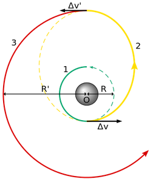

---
output:
  pdf_document: default
  html_document: default
---
# The Oberth effect: an argument for searching optimal strategies in psychopharmacology.
### Designing interventions based on neurocircuitry dynamics 
*Felipe Coelho Argolo*$^{1}$  
Universidade Federal de São Paulo, Universidade Federal da Bahia  
email: felipe.c.argolo @protonmail.com; @protonmail.com; @gmail.com  

## Abstract

*Keywords*: Psychopharmacology; 

\pagebreak

## Introduction

In psychiatry, treatment assets were predominantly discovered through serendipity events. The working mechanisms of effective interventions remain largely unaccounted by psychopathology and neurophysiology. Although some hypotheses had found support on consistent empirical data, coherent underlying rationales were elusive.  

Antidepressants levered valuable investigations about mental disorders, such as the chemical imbalance theory. Since depressed patients responded to changes in neurotransmitters concentration, it was conjectured that they might posess uncommon levels of neural chemicals.  
Following this line of thought, specific impairments were proposed for existing diagnostic clusters.  
Psychosis was investigated for dopaminergic alterations (Dopamine hypothesis), while depression was framed as a possible deficiency in molecules such as serotonin (Monoamine hypothesis).   
These ideas yielded advances, such as the development of clean (*n-th generation*) drugs targeting specific receptors. Second generation drugs carry less side effects while keeping effectiveness.  
Nonetheless, several observations remained unexplained, as the efficiency of  eletroconvulvetherapy for affective disorders and failed attempts to dettect different neurotransmitter levels between patients and healthy individuals. These anomalies were generally approached through ad-hoc hypotheses (e.g. normalization of chemical levels after electrically induced convulsions).  

In the last decades, multidisciplinary advances provided a better understanding of the brain.  
On the physiological aspect, we could describe neural dynamics with enhanced precision, including populational activity. Noteworthy milestones were also achieve in reverse engineering the information processing mechanisms.  
We may cite (1) encoding of reinforcement learning reward prediction errors by the neurons in the basal ganglia, (2) spatial mapping of visual stimuli to cortical (V1,V2,V3) neurons activity, (3) working memory attractor networks and long-term memory storage encoding in the hippocampus and (4) evolutively preserved central pattern generators for walking and swimming, (5) influence of the *period* gene in circadian rhythim.   

The unraveled details of neural functions in networks present across species
imply that the interaction among different brain structures is key in understanding behavior and abnormal instances of it.  
In the last decades, joint effort has led to more coherent theories about mental disorders, comprising previous anomalies.   
The co-evolving *state* dynamics of coupled neural circuits may be affected in several ways.  
Stable or quasi-stable states @Durstewitz,Huys.2018 related to behavioral patterns may be modified by changing the chemical concentrations. Mathematical modelling of physiological data describe how different perturbations may decrease (flatten), increase (deepen) or destroy (quash) these stable spaces. Stimulating D1 receptors deepen attractors, while D2 has the opposite effect @Durstewitz&Seamans,2008. Low concentrations of ketamine destabilize (quash) the system and may also explay how eletroconvulvetherapy acts on affective states.   

Focusing on information processing and system states (embodied cognition) eliminates previously cited paradoxes, since circuit states could be manipulated in equivalent ways either via electrical current or drugs.  

As expected, the prism of network dynamics (graph theory and dynamic system approaches) has solved some apparent contradictions, while also favoring insights for clinical taxonomy and phenotyping. This framework has also allowed for the conception of novel interventions targeting microenvironmental variables (e.g.microglia) and specific electrical activity (e.g. TMS) . @blood/fecal transplant JamesLeckman@Brunoni-TMS  

In this paper, we propose making use of temporal asymmetries in the brain network systems to optimze pharmacological effectiveness. This strategy is largely used by endochrinologists to modulate hormonal axes in consonance with their natural dynamics. Cardiologists induce a desired state with drugs and also observe cardiac cyclic states in order to maximize efficiency in cardioversion.  
In practice, instead of maintaining a constant or slowly-increasing dosage, a patient could respond to treatment by intaking oscilating dosages or specific planned periods. Researchers are already looking for the optimal regime in multiple session intervetions (e.g. infused sketamine or eletroconvulvetherapy).  
This perspective also opens the possibility for the development of new psychoactive drugs, targeting distinct pharmacokinects and microbioavaliability instead of disease-specific receptors.  

## Neurobehavior of mood

### Dynamical system modelling

## Attractors and the Hohmann orbit  

In the Oberth maneuver, a spacecraft falls into a gravitational well and accelerates when at maximum speed. This is more efficient to gain kinetic energy as compared to applying impulse outside of the well. In fact, the most energy-efficient method is at the lowest possible orbital periapsis, when orbital velocity is maximized.  

  

In general a Hohmann transfer orbit uses the minimum amount of energy to gradually spiral out of an attractor.
It is used to increase payload capacity considering a fixed amount of energy. European Swedish-designed satellite SMART-1 (2003) made use of this to spiral out of Earth until it deliberately crashed into the Moon (2006).  

## Proof of concept simulations

## Discussion

@ Reliable behavioral measures (EMA)
@ Roadmap: simulation -> Rand. Clin. Trial

\pagebreak